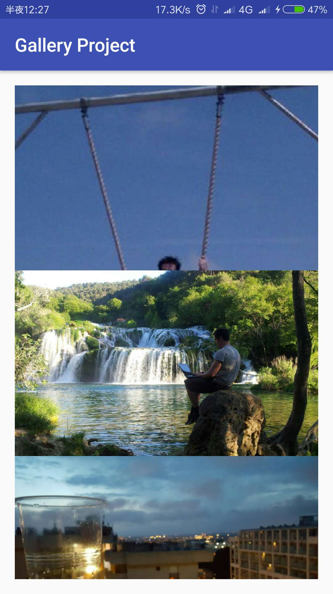
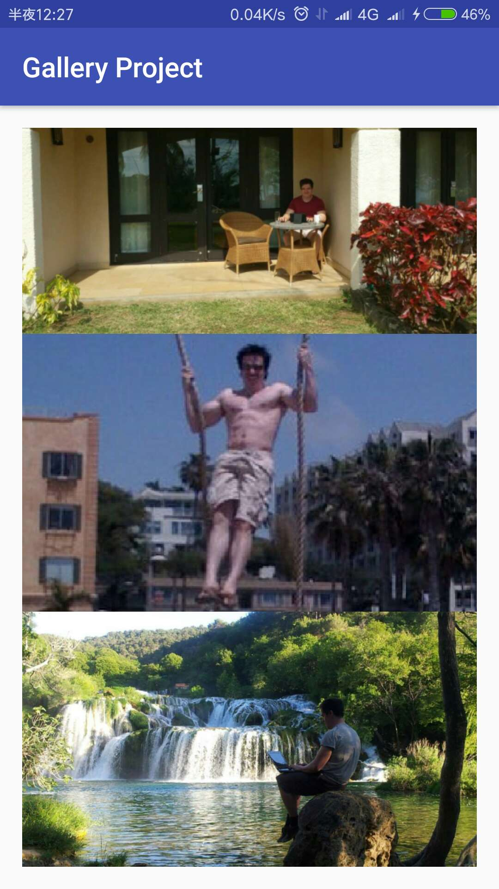
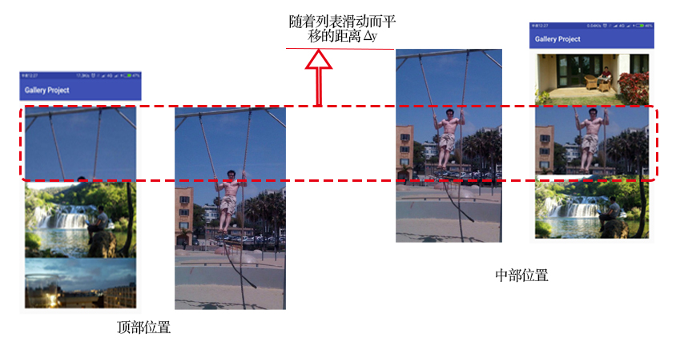

ScrollingImageView
========

 一个用于放置在RecycleView中的图片控件，其主要功能是跟随列表的上下滚动而上下平移，使得呈现出一种图像相对列表静止的感觉。

Overview
-----------

**ScrollingImageView** 提供以下特性：

* 在垂直方向上，使得该组件随着列表滚动而上线爱平移，可选参数：scrollType（middle | whole）。

**scrollType为whole时, 从刚进入列表和完全出列表是都在滚动**

**scrollType: middle时，仅当item完整展现在列列表中时才滚动**

**Demo** [示例代码](https://github.com/freedomofme/ScrollingImageView/tree/master/example)

Gradle integration
---------------

该库托管于jCenter仓库中，使用时只需要添加以下代码

	dependencies {
  	  compile 'site.okhttp.codeyel:scrollingImageView:1.0.0'
	}

Basic uasge
-----------

第一步：在列表的单个item中的对应布局中引入ScrollingImageView，例如:(item.xml)
	
	<com.yel.image.ScrollingImageView
        android:id="@+id/img"
        android:layout_width="match_parent"
        android:layout_height="200dp"
        custom:scrollType="middle"
    />

第二步：在代码中添加监听器

常规代码：

	final LinearLayoutManager layoutManager = new LinearLayoutManager(getApplicationContext());
  	recyclerView.setLayoutManager(layoutManager);
  	
需要添加的代码：
  	
  	recyclerView.addOnScrollListener(new ScrollingImageView.ScrollListener(layoutManager, R.id.img, index));
  	
  	
其中 {index} 表示item在列表中的索引值， {R.id.img} 对应android:id="@+id/img"

Advance uasge 
===

1. 开放自定义滚动的接口

Principle
===
1. 重写setFrame方法：通过postTranslate方法垂直平移图片，从而显示图片中的不同位置。
2. 设置OnScrollListener监听器，监听列表的滚动位置，来计算获得恰当的平移参数，并将其传递给步骤①中的postTranslate方法。

**如下图所示**

* 原图：

* 当在该控件顶部和在中部时：

* 平移时的前后对比

  	
Contribution
------------

Want to contribute? Please, feel free to create a pull request! ;)

License
----------

[Apache Version 2.0][License]

[License]:          http://www.apache.org/licenses/LICENSE-2.0.html
	
	
